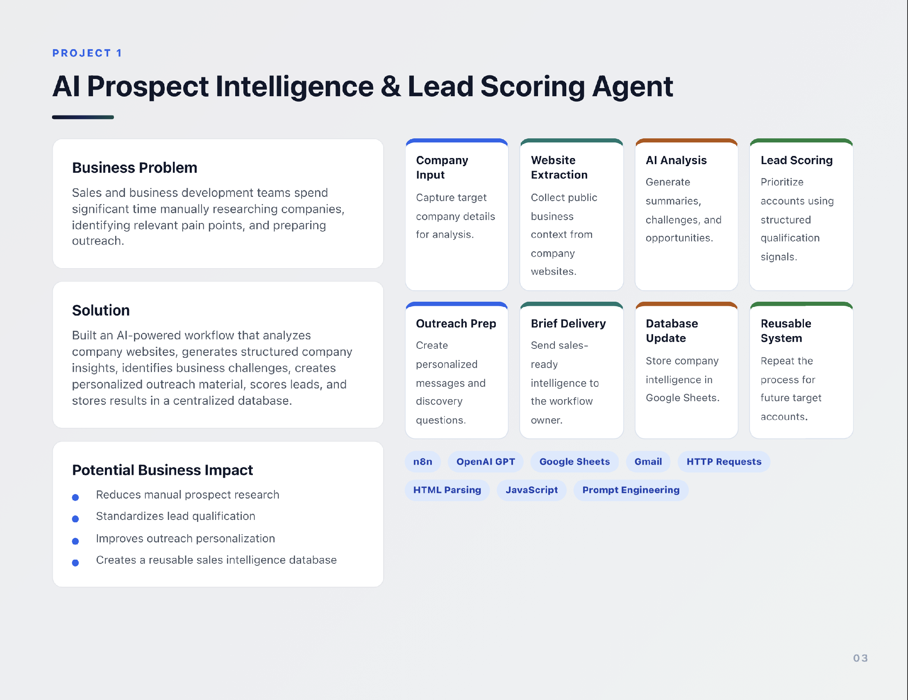

# AI Prospect Intelligence & Lead Scoring Agent

An AI-powered n8n workflow that automates company research: it extracts website content, generates concise intelligence, ranks opportunities with a lead score, and stores structured prospect data in Google Sheets (optionally sends a sales brief via Gmail).

This repository demonstrates how AI, automation, and lightweight orchestration replace time-consuming manual prospecting tasks for SDRs, BDRs, GTM teams, and founders.

---

## Key Features

- Automated website extraction and text cleaning
- AI-generated company summaries, ICP hints, and opportunity analysis
- Rule- and model-based lead scoring (structured signals)
- Personalized outreach (cold email + LinkedIn copy)
- Google Sheets as a centralized lead intelligence store
- Optional automated sales-brief delivery via Gmail
- Reusable n8n workflow that can be imported and adapted

---

## Architecture Overview



---

## Technologies Used

- n8n — Workflow automation and orchestration
- OpenAI GPT — Summarization, signal extraction, and message generation
- HTTP / HTML parsing — Fetch and clean website content
- Google Sheets API — Centralized storage for lead intelligence
- Gmail API — Optional brief delivery
- JavaScript (n8n Code Node) — Data cleaning & transformation
- Prompt engineering — Structured LLM outputs for predictable fields

---

## Repository Structure

```text
├── README.md
├── assets/
│   ├── google-sheets-output.png
│   ├── n8n-workflow.png
│   ├── workflow-diagram.png
│   └── placeholder.txt
├── docs/
│   ├── workflow-overview.md
│   ├── logic-breakdown.md
│   ├── prompt-engineering.md
│   ├── data-structure.md
│   └── api-requests.md
├── sample-output.json
└── placeholder.txt
```

---

## How It Works

1. Company input (name + URL) is provided to the workflow.
2. The workflow fetches the website HTML and extracts readable text (removes scripts/styles/boilerplate).
3. Cleaned text is submitted to OpenAI with a structured prompt that returns: summary, industry, ICP cues, challenges, automation opportunities, lead score, priority, outreach angle, cold email, LinkedIn message, and discovery questions.
4. A Code Node normalizes and validates the AI output into a consistent JSON shape.
5. The result is appended to Google Sheets and (optionally) emailed as a prospect brief.

---

## Getting started

Prerequisites

- n8n (self-hosted or cloud)
- OpenAI API key (or compatible LLM endpoint)
- Google APIs credentials for Sheets and Gmail (optional)

Quick steps

1. Import the n8n workflow (use the visual export in `assets/n8n-workflow.png` as a guide).
2. Configure credentials: OpenAI, Google Sheets, Gmail (if using email delivery).
3. Tweak the prompt (see `docs/prompt-engineering.md`) and the data mapping in the Code Node.
4. Run the workflow for a test company and inspect the output row in Google Sheets and `sample-output.json`.

Notes

- This repo contains documentation in `docs/` to help customize prompts, data schema, and API request formats.

---

## Use Cases

- SDRs / BDRs automating top-of-funnel research
- GTM teams enriching CRM records with AI-derived signals
- Founders validating ICP fit quickly for outreach
- Agencies scaling prospect audits and outreach personalization

---

## Sample Output

A real example of the final structured JSON output is available in: `sample-output.json`

This file shows the exact format stored in Google Sheets and delivered via email.

---

## Setup Instructions

1. Import the workflow JSON into **n8n**  
2. Add your **OpenAI API key**  
3. Connect **Google Sheets** via OAuth  
4. Connect **Gmail** via OAuth  
5. Update the Set Node with your target company name and website  
6. Run the workflow  

---

## Future Improvements

- Add CRM integration (HubSpot / Salesforce)  
- Add multi-page crawling for deeper analysis  
- Add competitor comparison  
- Add automated enrichment (LinkedIn, Crunchbase, etc.)  
- Add scoring model customization  

---

## License

This project is released under the MIT License.

---

## Contact

If you'd like help building automation workflows, AI agents, or GTM systems:

**Asad Ali**  
Growth & Automation | AI-FANTRY  
Magdeburg, Germany  

- **Email:** theasadali26@gmail.com  
- **LinkedIn:** https://linkedin.com/in/asad-ali26/


